# CppTrader 架构深度分析报告

> **项目版本**: 1.0.6.0 | **作者**: Ivan Shynkarenka | **协议**: MIT
> **分析日期**: 2026-06-02

---

## 目录

1. [项目概述](#1-项目概述)
2. [系统架构总览](#2-系统架构总览)
3. [模块详细架构](#3-模块详细架构)
4. [核心数据结构设计](#4-核心数据结构设计)
5. [订单匹配引擎深度分析](#5-订单匹配引擎深度分析)
6. [NASDAQ ITCH 协议处理器](#6-nasdaq-itch-协议处理器)
7. [内存管理策略](#7-内存管理策略)
8. [性能优化分析](#8-性能优化分析)
9. [测试体系](#9-测试体系)
10. [外部依赖关系](#10-外部依赖关系)
11. [设计模式总结](#11-设计模式总结)
12. [代码统计](#12-代码统计)

---

## 1. 项目概述

CppTrader 是一个高性能 C++ 交易组件库，提供三大核心能力：

| 组件 | 描述 | 性能指标 |
|------|------|----------|
| **NASDAQ ITCH Handler** | 流式解析 NASDAQ ITCH 5.0 协议 | ~41.5M msg/s |
| **Market Manager** | 完整的市场管理器 | ~3.2M msg/s, ~7.2M upd/s |
| **Matching Engine** | 自动/手动订单撮合引擎 | 支持6种订单类型 |

---

## 2. 系统架构总览

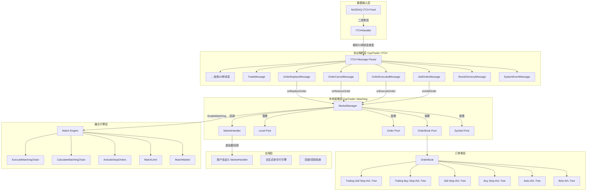

---

## 3. 模块详细架构

### 3.1 命名空间结构

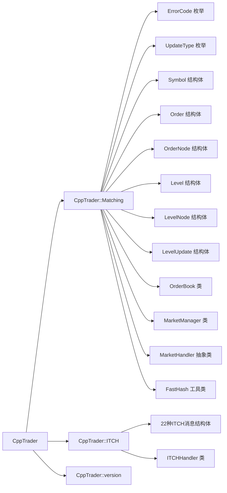

### 3.2 文件组织结构

```
CppTrader/
├── include/trader/                    # 公共头文件
│   ├── version.h                      # 版本定义
│   ├── matching/                      # 匹配引擎模块
│   │   ├── errors.h / .inl           # 错误码定义
│   │   ├── update.h / .inl           # 更新类型定义
│   │   ├── symbol.h / .inl           # 交易标的定义
│   │   ├── order.h / .inl            # 订单定义 (含工厂方法)
│   │   ├── level.h / .inl            # 价格层级定义
│   │   ├── order_book.h / .inl       # 订单簿定义
│   │   ├── market_handler.h          # 市场事件处理器(抽象基类)
│   │   ├── market_manager.h / .inl   # 市场管理器(核心类)
│   │   └── fast_hash.h / .inl        # 快速哈希工具
│   └── providers/nasdaq/              # NASDAQ数据源
│       └── itch_handler.h / .inl     # ITCH协议处理器
├── source/trader/                     # 实现文件
│   ├── matching/
│   │   ├── market_manager.cpp         # 市场管理器实现 (1763行)
│   │   ├── order.cpp                  # 订单验证逻辑
│   │   └── order_book.cpp            # 订单簿实现 (526行)
│   └── providers/nasdaq/
│       └── itch_handler.cpp           # ITCH处理器实现 (626行)
├── examples/                          # 使用示例
├── performance/                       # 性能基准测试
└── tests/                             # 单元测试
```

---

## 4. 核心数据结构设计

### 4.1 类关系图

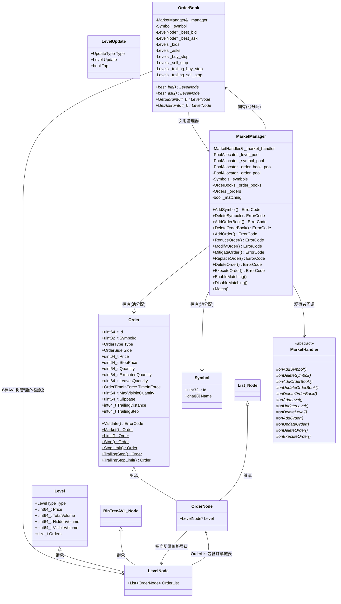

### 4.2 订单类型体系

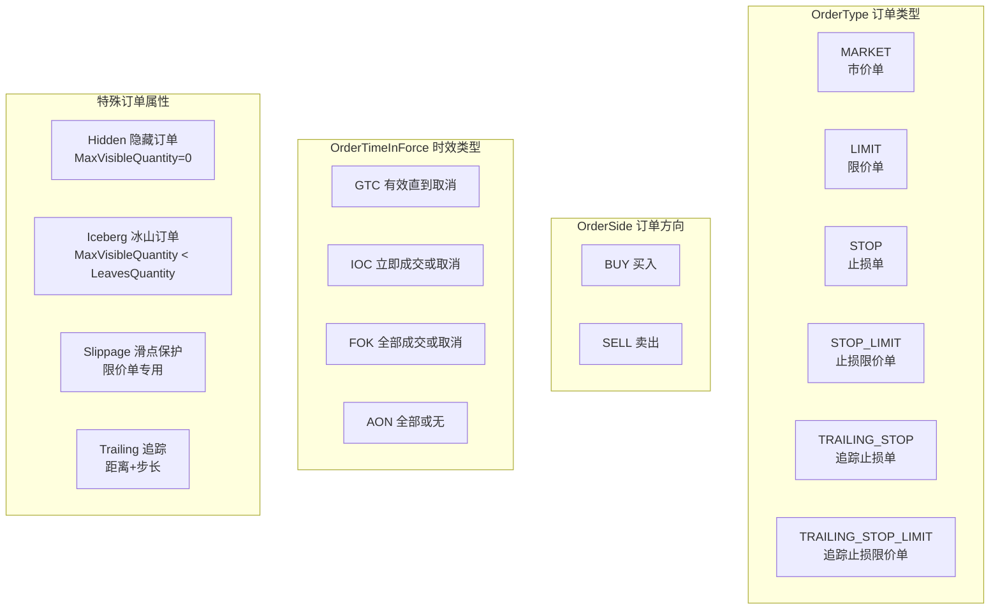

### 4.3 OrderBook 六棵AVL树结构

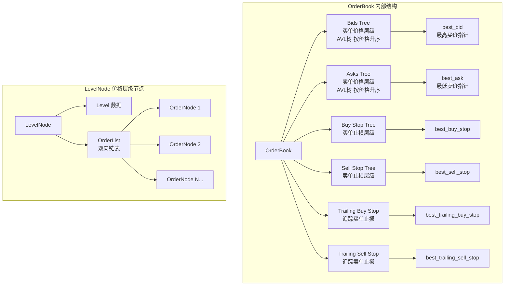

---

## 5. 订单匹配引擎深度分析

### 5.1 订单生命周期

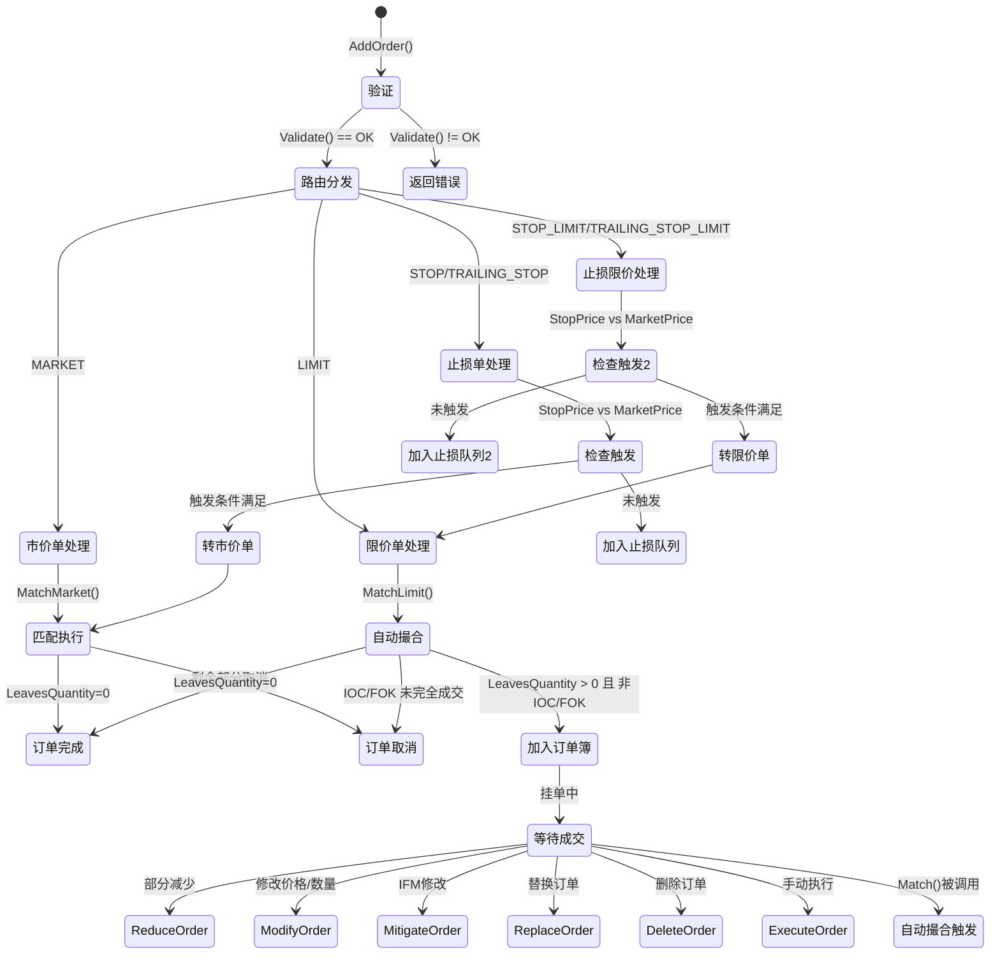

### 5.2 撮合算法流程

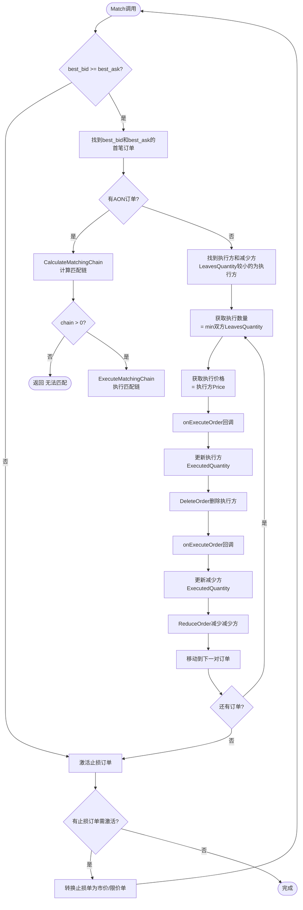

### 5.3 价格-时间优先匹配

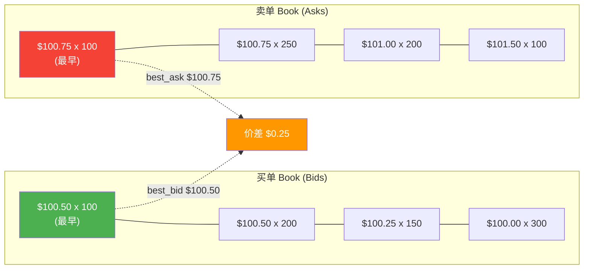

**撮合规则**：
- 买单价格 >= 卖单价格 → 可撮合
- 执行价格 = 先到达订单的价格（时间优先）
- 数量 = min(买方剩余量, 卖方剩余量)
- AON订单需要整条匹配链满足条件才能执行
- FOK订单在匹配链不满足时整体取消
- IOC订单尽可能匹配，剩余立即取消

### 5.4 止损订单激活机制

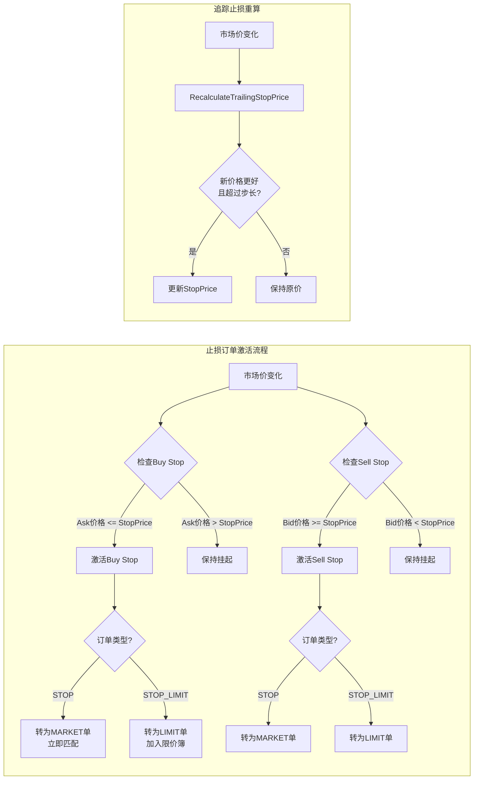

---

## 6. NASDAQ ITCH 协议处理器

### 6.1 ITCH 5.0 消息类型

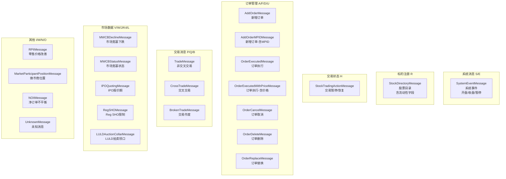

### 6.2 ITCH 处理流程

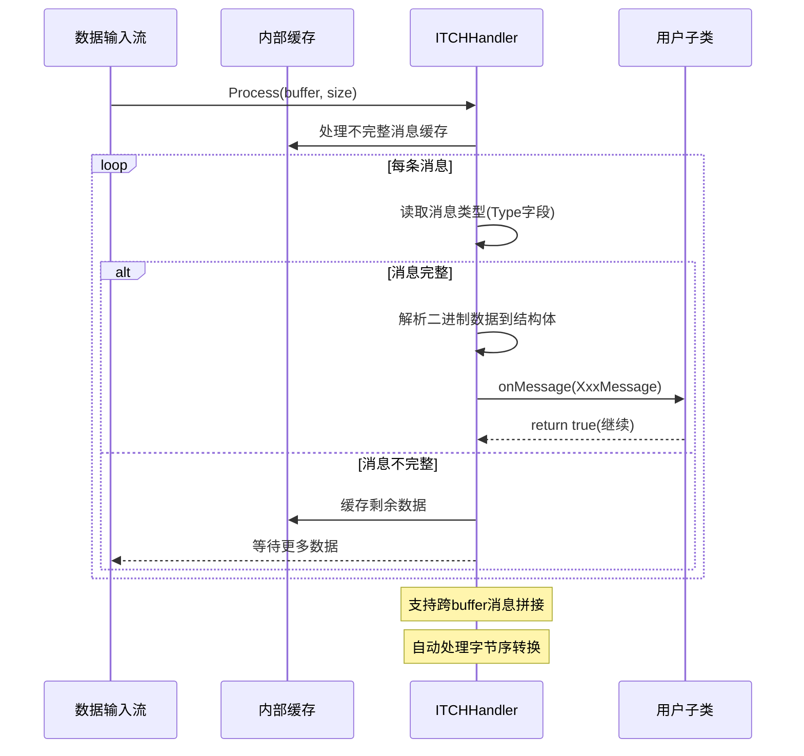

### 6.3 ITCH 到 MarketManager 集成

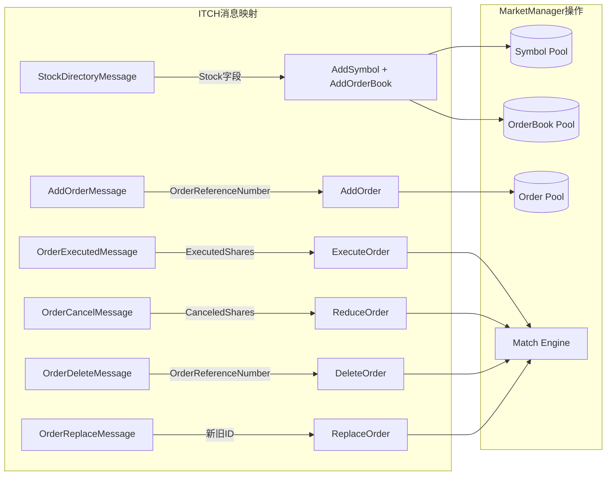

---

## 7. 内存管理策略

### 7.1 池化分配器架构

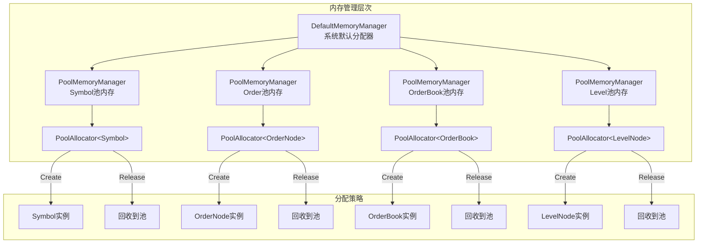

**性能优势**：
- 避免频繁的 `new/delete` 系统调用
- 内存局部性好，缓存命中率高
- O(1) 分配和释放复杂度
- 减少内存碎片

### 7.2 数据结构选择

| 数据结构 | 用途 | 复杂度 | 选择原因 |
|----------|------|--------|----------|
| `BinTreeAVL` (AVL树) | 价格层级管理 | O(log n) 插入/删除/查找 | 有序遍历，自动平衡 |
| `List` (双向链表) | 同价格层级的订单 | O(1) 插入/删除 | 时间优先排序 |
| `HashMap` | 订单ID索引 | O(1) 查找 | 快速订单查找 |
| `vector` | 符号/订单簿数组 | O(1) 按ID访问 | 符号ID连续 |

---

## 8. 性能优化分析

### 8.1 三级优化方案对比

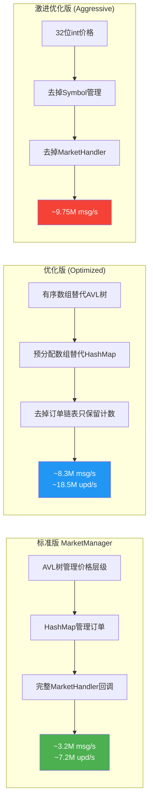

### 8.2 优化技巧详解

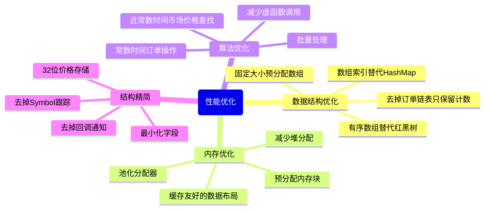

### 8.3 基准测试数据

| 指标 | 标准版 | 优化版 | 激进版 |
|------|--------|--------|--------|
| 消息吞吐量 | 3.2M msg/s | 8.3M msg/s | 9.75M msg/s |
| 消息延迟 | 309 ns | 120 ns | 102 ns |
| 更新吞吐量 | 7.2M upd/s | 18.5M upd/s | N/A |
| 更新延迟 | 138 ns | 54 ns | N/A |
| 最大标的数 | 8,371 | 8,371 | N/A |
| 最大订单数 | 1,647,972 | 1,647,972 | N/A |

---

## 9. 测试体系

### 9.1 测试结构

```mermaid
graph TD
    subgraph "测试套件"
        T1[test_itch_handler<br/>ITCH协议解析测试]
        T2[test_market_manager<br/>市场管理器集成测试]
        T3[test_matching_engine<br/>撮合引擎单元测试]
    end

    subgraph "ITCH测试 (1,563,071条消息)"
        T1 --> ITCH1[验证消息数量]
        T1 --> ITCH2[验证解析正确性]
        T1 --> ITCH3[验证错误数为0]
    end

    subgraph "MarketManager测试"
        T2 --> MM1[254,853 market updates]
        T2 --> MM2[最大8,352 symbols]
        T2 --> MM3[最大56,245 orders]
        T2 --> MM4[58,915 add/delete ops]
        T2 --> MM5[2,435 executions]
    end

    subgraph "撮合引擎测试 (716行)"
        T3 --> ME1[市价单撮合]
        T3 --> ME2[限价单撮合]
        T3 --> ME3[IOC限价单]
        T3 --> ME4[FOK限价单 - 成交/取消]
        T3 --> ME5[AON限价单 - 全部/部分/复杂]
        T3 --> ME6[隐藏/冰山订单]
        T3 --> ME7[止损单]
        T3 --> ME8[止损限价单]
        T3 --> ME9[追踪止损单]
        T3 --> ME10[IFM飞行中修改]
        T3 --> ME11[手动撮合]
    end
```

### 9.2 示例程序

| 示例 | 功能 | 输入 |
|------|------|------|
| `itch_handler` | 打印所有ITCH消息 | stdin ITCH数据 |
| `market_manager` | 打印所有市场事件 | stdin ITCH数据 |
| `matching_engine` | 交互式命令行引擎 | 用户命令 |

---

## 10. 外部依赖关系

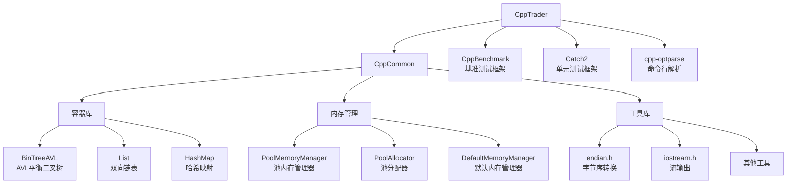

---

## 11. 设计模式总结

### 11.1 使用的设计模式

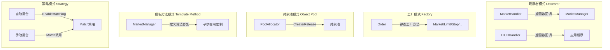

### 11.2 核心设计原则

| 原则 | 体现 |
|------|------|
| **单一职责** | MarketManager管理市场状态，OrderBook管理价格层级，MarketHandler处理事件通知 |
| **开闭原则** | 通过MarketHandler虚函数扩展，无需修改核心逻辑 |
| **依赖倒置** | MarketManager依赖MarketHandler抽象接口 |
| **接口隔离** | ITCHHandler的22个独立onMessage虚函数 |
| **高性能优先** | 池化分配、AVL树、缓存友好的数据布局 |

---

## 12. 代码统计

| 模块 | 文件数 | 头文件(.h/.inl) | 实现(.cpp) | 总行数(约) |
|------|--------|-----------------|------------|------------|
| Matching引擎 | 19 | 17 | 3 | ~3,500 |
| ITCH处理器 | 3 | 2 | 1 | ~1,100 |
| Examples | 3 | 0 | 3 | ~500 |
| Performance | 5 | 0 | 5 | ~800 |
| Tests | 5 | 1 | 4 | ~1,200 |
| **总计** | **35** | **20** | **16** | **~7,100** |

### 核心实现文件行数

| 文件 | 行数 | 职责 |
|------|------|------|
| `market_manager.cpp` | 1,763 | 撮合引擎核心逻辑 |
| `order_book.cpp` | 526 | 订单簿管理 |
| `itch_handler.cpp` | 626 | ITCH协议解析 |
| `test_matching_engine.cpp` | 716 | 撮合引擎测试 |
| `market_manager.h` | 291 | 市场管理器接口 |
| `order.h` | 321 | 订单定义+工厂方法 |
| `itch_handler.h` | 481 | ITCH消息定义 |

---

## 附录：关键API速查

### MarketManager 核心API

```
AddSymbol(Symbol)                    → ErrorCode    // 添加交易标的
DeleteSymbol(id)                     → ErrorCode    // 删除交易标的
AddOrderBook(Symbol)                 → ErrorCode    // 添加订单簿
DeleteOrderBook(id)                  → ErrorCode    // 删除订单簿
AddOrder(Order)                      → ErrorCode    // 添加订单
ReduceOrder(id, quantity)            → ErrorCode    // 减少订单数量
ModifyOrder(id, price, quantity)     → ErrorCode    // 修改订单
MitigateOrder(id, price, quantity)   → ErrorCode    // IFM修改
ReplaceOrder(id, new_id, price, qty) → ErrorCode    // 替换订单
DeleteOrder(id)                      → ErrorCode    // 删除订单
ExecuteOrder(id, quantity)           → ErrorCode    // 手动执行
EnableMatching()                                  // 启用自动撮合
DisableMatching()                                 // 禁用自动撮合
Match()                                           // 手动触发撮合
```

### Order 静态工厂方法

```
Order::Market(id, symbol, side, qty)
Order::BuyLimit(id, symbol, price, qty, tif, max_visible)
Order::SellLimit(id, symbol, price, qty, tif, max_visible)
Order::BuyStop(id, symbol, stop_price, qty, tif, slippage)
Order::SellStop(id, symbol, stop_price, qty, tif, slippage)
Order::BuyStopLimit(id, symbol, stop_price, price, qty, tif, max_visible)
Order::TrailingBuyStop(id, symbol, stop_price, qty, distance, step, tif, slippage)
Order::TrailingSellStopLimit(id, symbol, stop_price, price, qty, distance, step, tif, max_visible)
```

---

*本报告基于 CppTrader v1.0.6.0 源码深度分析生成*
