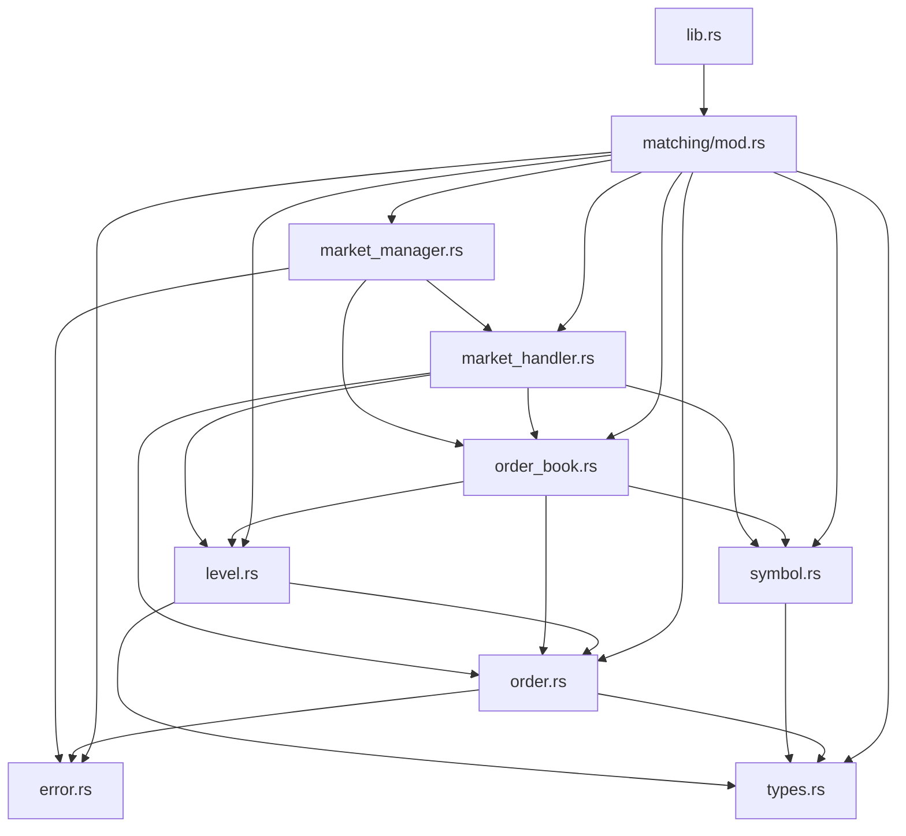
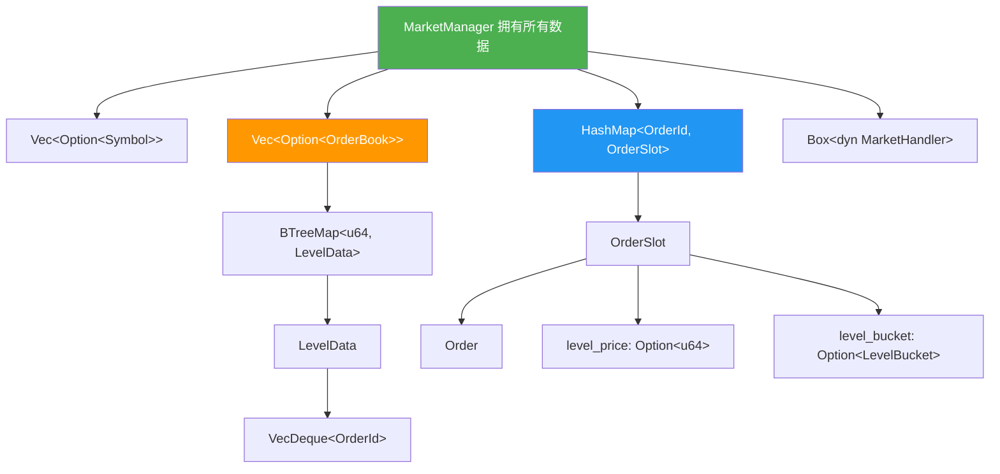

# CppTrader Rust 移植计划

> **目标**: 将 CppTrader 的 MarketManager 和 MatchingEngine 从 C++ 移植到 Rust
> **Rust 版本**: 1.96 (2024 edition)
> **设计原则**: 保持相同架构，利用 Rust 特性，最少 unsafe

---

## 目录

1. [项目结构](#1-项目结构)
2. [依赖选型](#2-依赖选型)
3. [模块设计](#3-模块设计)
4. [核心数据结构](#4-核心数据结构)
5. [内存管理策略](#5-内存管理策略)
6. [事件系统设计](#6-事件系统设计)
7. [撮合引擎实现](#7-撮合引擎实现)
8. [测试计划](#8-测试计划)
9. [实现顺序](#9-实现顺序)

---

## 1. 项目结构

```
cpptrader-rs/
├── Cargo.toml
├── src/
│   ├── lib.rs                      # crate 根，re-export 所有公共 API
│   ├── matching/
│   │   ├── mod.rs                  # matching 模块入口
│   │   ├── error.rs                # ErrorCode 枚举 → Result 类型
│   │   ├── types.rs                # OrderSide, OrderType, OrderTimeInForce, LevelType, UpdateType
│   │   ├── symbol.rs               # Symbol 结构体
│   │   ├── order.rs                # Order 结构体 + 工厂方法 + Validate
│   │   ├── level.rs                # Level, LevelUpdate 结构体
│   │   ├── order_book.rs           # OrderBook 实现
│   │   ├── market_handler.rs       # MarketHandler trait
│   │   └── market_manager.rs       # MarketManager 核心实现
│   └── util.rs                     # FastHash 等工具
├── benches/
│   └── matching.rs                 # Criterion 基准测试
├── examples/
│   ├── matching_engine.rs          # 交互式命令行引擎
│   └── market_manager.rs           # ITCH 数据回放示例
└── tests/
    ├── matching_engine_tests.rs    # 撮合引擎单元测试
    └── market_manager_tests.rs     # 市场管理器集成测试
```

---

## 2. 依赖选型

```toml
[package]
name = "cpptrader"
version = "0.1.0"
edition = "2024"
rust-version = "1.96"
license = "MIT"
description = "High-performance trading components ported from CppTrader"

[dependencies]
hashbrown = "0.17"          # 高性能 HashMap (SwissTable), 比 std 更快
thiserror = "2.0"           # 错误类型派生宏

[dev-dependencies]
criterion = "0.8"           # 微基准测试框架

[[bench]]
name = "matching"
harness = false
```

**选型理由**：

| 组件 | C++ 实现 | Rust 实现 | 理由 |
|------|----------|-----------|------|
| 价格层级树 | `BinTreeAVL<LevelNode>` | `std::collections::BTreeMap<u64, LevelData>` | std 自带，O(log n)，有序遍历 |
| 订单链表 | `List<OrderNode>` 双向链表 | `std::collections::VecDeque<OrderId>` | 缓存友好，O(1) 头尾操作 |
| 订单索引 | `HashMap<u64, OrderNode*, FastHash>` | `hashbrown::HashMap<u64, OrderSlot>` | SwissTable 更快，slot 模式避免指针 |
| 对象池 | `PoolAllocator<T>` | `hashbrown::HashMap` + 内联存储 | Rust 所有权模型自然管理 |
| 符号存储 | `vector<Symbol*>` | `Vec<Option<Symbol>>` | 按 ID 索引，无指针 |
| 订单簿存储 | `vector<OrderBook*>` | `Vec<Option<OrderBook>>` | 按 symbol ID 索引 |

---

## 3. 模块设计

### 3.1 模块依赖关系



### 3.2 与 C++ 的映射

| C++ 组件 | Rust 组件 | 变化说明 |
|----------|-----------|----------|
| `ErrorCode` enum | `Result<T, ErrorCode>` | Rust 惯用 Result 模式 |
| `MarketHandler` 虚基类 | `MarketHandler` trait | trait + dyn dispatch |
| `Order::BuyLimit()` 静态方法 | `Order::buy_limit()` 关联函数 | snake_case 命名 |
| `PoolAllocator<T>` | 内联在 HashMap 中 | Rust 所有权替代池分配 |
| raw pointer `OrderNode*` | `OrderId` (u64 索引) | 无指针设计 |
| `BinTreeAVL<LevelNode>` | `BTreeMap<u64, LevelData>` | 标准库有序映射 |
| `List<OrderNode>` | `VecDeque<OrderId>` | 标准库双端队列 |
| `_best_bid` / `_best_ask` 指针 | `BTreeMap::iter().next_back/next()` | 按需查询，O(1) amortized |

---

## 4. 核心数据结构

### 4.1 枚举定义 (`types.rs`)

```rust
#[derive(Debug, Clone, Copy, PartialEq, Eq, Hash)]
#[repr(u8)]
pub enum OrderSide {
    Buy,
    Sell,
}

#[derive(Debug, Clone, Copy, PartialEq, Eq, Hash)]
#[repr(u8)]
pub enum OrderType {
    Market,
    Limit,
    Stop,
    StopLimit,
    TrailingStop,
    TrailingStopLimit,
}

#[derive(Debug, Clone, Copy, PartialEq, Eq, Hash)]
#[repr(u8)]
pub enum OrderTimeInForce {
    Gtc, // Good-Till-Cancelled
    Ioc, // Immediate-Or-Cancel
    Fok, // Fill-Or-Kill
    Aon, // All-Or-None
}

#[derive(Debug, Clone, Copy, PartialEq, Eq, Hash)]
#[repr(u8)]
pub enum LevelType {
    Bid,
    Ask,
}

#[derive(Debug, Clone, Copy, PartialEq, Eq, Hash)]
#[repr(u8)]
pub enum UpdateType {
    None,
    Add,
    Update,
    Delete,
}
```

### 4.2 错误类型 (`error.rs`)

```rust
use thiserror::Error;

#[derive(Debug, Clone, Copy, PartialEq, Eq, Error)]
pub enum ErrorCode {
    #[error("OK")]
    Ok,
    #[error("Symbol duplicate")]
    SymbolDuplicate,
    #[error("Symbol not found")]
    SymbolNotFound,
    #[error("Order book duplicate")]
    OrderBookDuplicate,
    #[error("Order book not found")]
    OrderBookNotFound,
    #[error("Order duplicate")]
    OrderDuplicate,
    #[error("Order not found")]
    OrderNotFound,
    #[error("Order ID invalid")]
    OrderIdInvalid,
    #[error("Order type invalid")]
    OrderTypeInvalid,
    #[error("Order parameter invalid")]
    OrderParameterInvalid,
    #[error("Order quantity invalid")]
    OrderQuantityInvalid,
}

pub type Result<T> = std::result::Result<T, ErrorCode>;
```

**与 C++ 的差异**: C++ 使用 `ErrorCode` 返回值 + assert；Rust 使用 `Result<T, ErrorCode>` 惯用模式。公开 API 返回 `Result<()>`，内部实现可以使用 `?` 操作符。

### 4.3 Symbol (`symbol.rs`)

```rust
#[derive(Debug, Clone, Copy)]
pub struct Symbol {
    pub id: u32,
    pub name: [u8; 8],  // 固定8字节，对应 C++ char[8]
}

impl Symbol {
    pub fn new(id: u32, name: &[u8; 8]) -> Self {
        Self { id, name: *name }
    }

    pub fn name_str(&self) -> &str {
        // 安全地转换为字符串，截断到第一个 null 字节
        let end = self.name.iter().position(|&b| b == 0).unwrap_or(8);
        std::str::from_utf8(&self.name[..end]).unwrap_or("")
    }
}
```

### 4.4 Order (`order.rs`)

```rust
/// 订单 ID 类型别名
pub type OrderId = u64;

#[derive(Debug, Clone)]
pub struct Order {
    pub id: OrderId,
    pub symbol_id: u32,
    pub order_type: OrderType,
    pub side: OrderSide,
    pub price: u64,
    pub stop_price: u64,
    pub quantity: u64,
    pub executed_quantity: u64,
    pub leaves_quantity: u64,
    pub time_in_force: OrderTimeInForce,
    pub max_visible_quantity: u64,
    pub slippage: u64,
    pub trailing_distance: i64,
    pub trailing_step: i64,
}

impl Order {
    // ---------- 计算属性 ----------

    pub fn hidden_quantity(&self) -> u64 {
        if self.leaves_quantity > self.max_visible_quantity {
            self.leaves_quantity - self.max_visible_quantity
        } else {
            0
        }
    }

    pub fn visible_quantity(&self) -> u64 {
        self.leaves_quantity.min(self.max_visible_quantity)
    }

    // ---------- 类型判断 ----------

    pub fn is_market(&self) -> bool { self.order_type == OrderType::Market }
    pub fn is_limit(&self) -> bool { self.order_type == OrderType::Limit }
    pub fn is_stop(&self) -> bool { self.order_type == OrderType::Stop }
    pub fn is_stop_limit(&self) -> bool { self.order_type == OrderType::StopLimit }
    pub fn is_trailing_stop(&self) -> bool { self.order_type == OrderType::TrailingStop }
    pub fn is_trailing_stop_limit(&self) -> bool { self.order_type == OrderType::TrailingStopLimit }
    pub fn is_buy(&self) -> bool { self.side == OrderSide::Buy }
    pub fn is_sell(&self) -> bool { self.side == OrderSide::Sell }
    pub fn is_gtc(&self) -> bool { self.time_in_force == OrderTimeInForce::Gtc }
    pub fn is_ioc(&self) -> bool { self.time_in_force == OrderTimeInForce::Ioc }
    pub fn is_fok(&self) -> bool { self.time_in_force == OrderTimeInForce::Fok }
    pub fn is_aon(&self) -> bool { self.time_in_force == OrderTimeInForce::Aon }
    pub fn is_hidden(&self) -> bool { self.max_visible_quantity == 0 }
    pub fn is_iceberg(&self) -> bool { self.max_visible_quantity < u64::MAX }
    pub fn is_slippage(&self) -> bool { self.slippage < u64::MAX }

    // ---------- 验证 ----------

    pub fn validate(&self) -> ErrorCode { /* 完整移植 C++ Validate() 逻辑 */ }

    // ---------- 18 个工厂方法 ----------

    pub fn market(id: OrderId, symbol_id: u32, side: OrderSide, quantity: u64, slippage: u64) -> Self { /* ... */ }
    pub fn buy_market(id: OrderId, symbol_id: u32, quantity: u64, slippage: u64) -> Self { /* ... */ }
    pub fn sell_market(id: OrderId, symbol_id: u32, quantity: u64, slippage: u64) -> Self { /* ... */ }

    pub fn limit(id: OrderId, symbol_id: u32, side: OrderSide, price: u64, quantity: u64,
                 tif: OrderTimeInForce, max_visible_quantity: u64) -> Self { /* ... */ }
    pub fn buy_limit(id: OrderId, symbol_id: u32, price: u64, quantity: u64,
                     tif: OrderTimeInForce, max_visible_quantity: u64) -> Self { /* ... */ }
    pub fn sell_limit(id: OrderId, symbol_id: u32, price: u64, quantity: u64,
                      tif: OrderTimeInForce, max_visible_quantity: u64) -> Self { /* ... */ }

    // ... Stop, StopLimit, TrailingStop, TrailingStopLimit 各3个
    // ... 共18个工厂方法，完全对应 C++ 实现
}
```

**关键设计决策**:
- `Order` 是值类型 (Clone)，不使用引用计数
- 工厂方法使用 `snake_case` 命名，对应 C++ 的 `PascalCase`
- 默认参数用 `Default` trait 或 Builder 模式实现
- `u64::MAX` 作为哨兵值，与 C++ 完全一致

### 4.5 Level (`level.rs`)

```rust
/// 价格层级 ID 类型
pub type LevelId = u64;

#[derive(Debug, Clone)]
pub struct Level {
    pub level_type: LevelType,
    pub price: u64,
    pub total_volume: u64,
    pub hidden_volume: u64,
    pub visible_volume: u64,
    pub orders: usize,
}

impl Level {
    pub fn new(level_type: LevelType, price: u64) -> Self {
        Self {
            level_type,
            price,
            total_volume: 0,
            hidden_volume: 0,
            visible_volume: 0,
            orders: 0,
        }
    }

    pub fn is_bid(&self) -> bool { self.level_type == LevelType::Bid }
    pub fn is_ask(&self) -> bool { self.level_type == LevelType::Ask }
}

/// 价格层级更新通知
#[derive(Debug, Clone)]
pub struct LevelUpdate {
    pub update_type: UpdateType,
    pub level: Level,
    pub top: bool,
}
```

### 4.6 OrderBook 内部数据结构 (`order_book.rs`)

```rust
use std::collections::{BTreeMap, VecDeque};
use crate::matching::{order::OrderId, level::Level, symbol::Symbol};

/// 价格层级内部数据（替代 C++ LevelNode）
#[derive(Debug)]
struct LevelData {
    level: Level,
    order_queue: VecDeque<OrderId>,  // 时间优先的订单队列
}

/// OrderBook 核心结构
#[derive(Debug)]
pub struct OrderBook {
    symbol: Symbol,

    // ---- 6 棵 BTreeMap 替代 6 棵 AVL 树 ----
    // key = price, value = LevelData
    bids: BTreeMap<u64, LevelData>,
    asks: BTreeMap<u64, LevelData>,
    buy_stop: BTreeMap<u64, LevelData>,
    sell_stop: BTreeMap<u64, LevelData>,
    trailing_buy_stop: BTreeMap<u64, LevelData>,
    trailing_sell_stop: BTreeMap<u64, LevelData>,

    // ---- 市场价格追踪 ----
    last_bid_price: u64,         // 初始 0
    last_ask_price: u64,         // 初始 u64::MAX
    matching_bid_price: u64,     // 初始 0
    matching_ask_price: u64,     // 初始 u64::MAX
    trailing_bid_price: u64,     // 初始 0
    trailing_ask_price: u64,     // 初始 u64::MAX
}

impl OrderBook {
    // ---- 查询方法 ----
    pub fn best_bid(&self) -> Option<&LevelData> { self.bids.values().next_back() }
    pub fn best_ask(&self) -> Option<&LevelData> { self.asks.values().next() }
    pub fn bids(&self) -> &BTreeMap<u64, LevelData> { &self.bids }
    pub fn asks(&self) -> &BTreeMap<u64, LevelData> { &self.asks }
    // ... 其他6个集合的 getter

    pub fn get_bid(&self, price: u64) -> Option<&LevelData> { self.bids.get(&price) }
    pub fn get_ask(&self, price: u64) -> Option<&LevelData> { self.asks.get(&price) }

    // ---- 核心操作 (返回 LevelUpdate) ----
    fn add_order(&mut self, order: &Order) -> LevelUpdate { /* ... */ }
    fn reduce_order(&mut self, order: &Order, qty: u64, hidden: u64, visible: u64) -> LevelUpdate { /* ... */ }
    fn delete_order(&mut self, order: &Order) -> LevelUpdate { /* ... */ }

    // ---- 止损操作 ----
    fn add_stop_order(&mut self, order: &Order) { /* ... */ }
    fn reduce_stop_order(&mut self, order: &Order, qty: u64, hidden: u64, visible: u64) { /* ... */ }
    fn delete_stop_order(&mut self, order: &Order) { /* ... */ }

    // ---- 追踪止损操作 ----
    fn add_trailing_stop_order(&mut self, order: &Order) { /* ... */ }
    fn reduce_trailing_stop_order(&mut self, order: &Order, qty: u64, hidden: u64, visible: u64) { /* ... */ }
    fn delete_trailing_stop_order(&mut self, order: &Order) { /* ... */ }

    // ---- 价格计算 ----
    pub fn get_market_price_bid(&self) -> u64 { /* max(matching_bid, best_bid.price) */ }
    pub fn get_market_price_ask(&self) -> u64 { /* min(matching_ask, best_ask.price) */ }
    pub fn calculate_trailing_stop_price(&self, order: &Order) -> u64 { /* ... */ }
    pub fn update_last_price(&mut self, order: &Order, price: u64) { /* ... */ }
    pub fn update_matching_price(&mut self, order: &Order, price: u64) { /* ... */ }
    pub fn reset_matching_price(&mut self) { /* ... */ }
}
```

**与 C++ 的关键差异**:

| C++ 实现 | Rust 实现 | 优势 |
|----------|-----------|------|
| `BinTreeAVL<LevelNode>` + `_best_bid` 指针 | `BTreeMap<u64, LevelData>` + `iter().next_back()` | 无需维护指针，自动排序 |
| `List<OrderNode>` 双向链表 | `VecDeque<OrderId>` | 缓存友好，O(1) 头尾操作 |
| `LevelNode*` 裸指针 | `&mut LevelData` 引用 | 借用检查保证安全 |
| `order->Level = level_ptr` 指针缓存 | 直接按 price 查 BTreeMap | O(log n) 但无指针风险 |
| `DeleteLevel` 更新 `_best_bid` 指针 | `BTreeMap::remove()` 自动处理 | 无需手动维护 |

### 4.7 MarketManager (`market_manager.rs`)

```rust
use hashbrown::HashMap;
use crate::matching::{
    error::{ErrorCode, Result},
    market_handler::MarketHandler,
    order::{Order, OrderId},
    order_book::OrderBook,
    symbol::Symbol,
    types::*,
};

/// 订单存储槽（替代 C++ OrderNode + PoolAllocator）
#[derive(Debug)]
struct OrderSlot {
    order: Order,
    /// 订单所在的价格层级价格（用于快速定位 BTreeMap 中的 LevelData）
    level_price: Option<u64>,
    /// 订单所在的价格层级类型（bids/asks/buy_stop/sell_stop/trailing_buy_stop/trailing_sell_stop）
    level_bucket: Option<LevelBucket>,
}

#[derive(Debug, Clone, Copy, PartialEq, Eq)]
enum LevelBucket {
    Bids,
    Asks,
    BuyStop,
    SellStop,
    TrailingBuyStop,
    TrailingSellStop,
}

pub struct MarketManager {
    // ---- 事件处理器 ----
    // 使用 trait object 而非泛型，允许运行时多态
    handler: Box<dyn MarketHandler>,

    // ---- 存储 ----
    symbols: Vec<Option<Symbol>>,                    // 按 symbol_id 索引
    order_books: Vec<Option<OrderBook>>,             // 按 symbol_id 索引
    orders: HashMap<OrderId, OrderSlot>,             // 按 order_id 索引

    // ---- 配置 ----
    matching: bool,
}

impl MarketManager {
    // ---- 构造 ----
    pub fn new(handler: Box<dyn MarketHandler>) -> Self { /* ... */ }
    pub fn with_default_handler() -> Self { /* 使用 NoOpHandler */ }

    // ---- 查询 ----
    pub fn get_symbol(&self, id: u32) -> Option<&Symbol> { /* ... */ }
    pub fn get_order_book(&self, id: u32) -> Option<&OrderBook> { /* ... */ }
    pub fn get_order(&self, id: OrderId) -> Option<&Order> { /* ... */ }

    // ---- 标的管理 ----
    pub fn add_symbol(&mut self, symbol: Symbol) -> Result<()> { /* ... */ }
    pub fn delete_symbol(&mut self, id: u32) -> Result<()> { /* ... */ }

    // ---- 订单簿管理 ----
    pub fn add_order_book(&mut self, symbol: &Symbol) -> Result<()> { /* ... */ }
    pub fn delete_order_book(&mut self, id: u32) -> Result<()> { /* ... */ }

    // ---- 订单生命周期 ----
    pub fn add_order(&mut self, order: Order) -> Result<()> { /* ... */ }
    pub fn reduce_order(&mut self, id: OrderId, quantity: u64) -> Result<()> { /* ... */ }
    pub fn modify_order(&mut self, id: OrderId, new_price: u64, new_quantity: u64) -> Result<()> { /* ... */ }
    pub fn mitigate_order(&mut self, id: OrderId, new_price: u64, new_quantity: u64) -> Result<()> { /* ... */ }
    pub fn replace_order(&mut self, id: OrderId, new_id: OrderId, new_price: u64, new_quantity: u64) -> Result<()> { /* ... */ }
    pub fn replace_order_with(&mut self, id: OrderId, new_order: Order) -> Result<()> { /* ... */ }
    pub fn delete_order(&mut self, id: OrderId) -> Result<()> { /* ... */ }
    pub fn execute_order(&mut self, id: OrderId, quantity: u64) -> Result<()> { /* ... */ }
    pub fn execute_order_at(&mut self, id: OrderId, price: u64, quantity: u64) -> Result<()> { /* ... */ }

    // ---- 撮合控制 ----
    pub fn is_matching_enabled(&self) -> bool { self.matching }
    pub fn enable_matching(&mut self) { self.matching = true; self.match_all(); }
    pub fn disable_matching(&mut self) { self.matching = false; }
    pub fn match_all(&mut self) { /* 遍历所有 order_books 调用 match_book */ }

    // ---- 内部撮合方法 ----
    fn add_market_order(&mut self, order: Order, recursive: bool) -> Result<()> { /* ... */ }
    fn add_limit_order(&mut self, order: Order, recursive: bool) -> Result<()> { /* ... */ }
    fn add_stop_order(&mut self, order: Order, recursive: bool) -> Result<()> { /* ... */ }
    fn add_stop_limit_order(&mut self, order: Order, recursive: bool) -> Result<()> { /* ... */ }

    fn match_book(&mut self, symbol_id: u32) { /* 主撮合循环 */ }
    fn match_market(&mut self, symbol_id: u32, order: &mut Order) { /* ... */ }
    fn match_limit(&mut self, symbol_id: u32, order: &mut Order) { /* ... */ }
    fn match_order(&mut self, symbol_id: u32, order: &mut Order) { /* ... */ }

    fn activate_stop_orders(&mut self, symbol_id: u32) -> bool { /* ... */ }
    fn calculate_matching_chain(&self, symbol_id: u32, ...) -> u64 { /* ... */ }
    fn execute_matching_chain(&mut self, symbol_id: u32, ...) { /* ... */ }
    fn recalculate_trailing_stop_price(&mut self, symbol_id: u32, ...) { /* ... */ }

    fn update_level(&mut self, symbol_id: u32, update: &LevelUpdate) { /* 调用 handler 回调 */ }
}
```

**所有权设计关键点**:



**Rust 所有权安全保证**:
- `MarketManager` 独占拥有所有 `Symbol`、`OrderBook`、`Order`
- `OrderBook` 独占拥有其 `BTreeMap<u64, LevelData>`
- `LevelData` 独占拥有 `VecDeque<OrderId>`
- `OrderId` 是 `u64` 值类型，可自由复制
- 查找订单通过 `HashMap<OrderId, OrderSlot>` 的 O(1) 查表，无需指针

---

## 5. 内存管理策略

### 5.1 对比 C++ 池分配器

| C++ 策略 | Rust 策略 | 分析 |
|----------|-----------|------|
| `PoolAllocator<Symbol>` | `Vec<Option<Symbol>>` | 符号 ID 连续，Vec 按 ID 索引即可 |
| `PoolAllocator<OrderBook>` | `Vec<Option<OrderBook>>` | 同上，按 symbol_id 索引 |
| `PoolAllocator<OrderNode>` | `HashMap<OrderId, OrderSlot>` | hashbrown SwissTable 性能接近池分配 |
| `PoolAllocator<LevelNode>` | 内联在 `BTreeMap` 中 | BTreeMap 节点由标准库管理 |
| `List<OrderNode>` 链表 | `VecDeque<OrderId>` 队列 | 只存 ID，数据在 HashMap 中 |

### 5.2 为什么不需要 unsafe

C++ 使用裸指针和自定义池分配器是因为：
1. 链表节点需要自引用 (`Node* prev, *next`)
2. AVL 树节点需要父/子指针
3. 订单需要指向价格层级的指针

Rust 通过**间接索引**避免了所有这些：
1. `VecDeque<OrderId>` 替代链表 —— 无自引用
2. `BTreeMap<u64, LevelData>` 替代 AVL 树 —— 标准库管理内部指针
3. `HashMap<OrderId, OrderSlot>` 中的 `level_price` + `level_bucket` 替代指针 —— O(log n) 查找替代 O(1) 指针解引用

**性能权衡**: 每次访问价格层级从 C++ 的 O(1) 指针解引用变为 Rust 的 O(log n) BTreeMap 查找。但由于 BTreeMap 对缓存友好且价格层级数量有限（通常 < 1000），实际性能差异很小。

---

## 6. 事件系统设计

### 6.1 MarketHandler trait (`market_handler.rs`)

```rust
use crate::matching::{level::Level, order::Order, order_book::OrderBook, symbol::Symbol};

/// 市场事件处理器 trait
///
/// 对应 C++ MarketHandler 虚基类。所有方法都有默认空实现，
/// 用户只需覆盖关心的回调。
pub trait MarketHandler {
    // ---- 标的事件 ----
    fn on_add_symbol(&mut self, _symbol: &Symbol) {}
    fn on_delete_symbol(&mut self, _symbol: &Symbol) {}

    // ---- 订单簿事件 ----
    fn on_add_order_book(&mut self, _order_book: &OrderBook) {}
    fn on_update_order_book(&mut self, _order_book: &OrderBook, _top: bool) {}
    fn on_delete_order_book(&mut self, _order_book: &OrderBook) {}

    // ---- 价格层级事件 ----
    fn on_add_level(&mut self, _order_book: &OrderBook, _level: &Level, _top: bool) {}
    fn on_update_level(&mut self, _order_book: &OrderBook, _level: &Level, _top: bool) {}
    fn on_delete_level(&mut self, _order_book: &OrderBook, _level: &Level, _top: bool) {}

    // ---- 订单事件 ----
    fn on_add_order(&mut self, _order: &Order) {}
    fn on_update_order(&mut self, _order: &Order) {}
    fn on_delete_order(&mut self, _order: &Order) {}

    // ---- 执行事件 ----
    fn on_execute_order(&mut self, _order: &Order, _price: u64, _quantity: u64) {}
}

/// 默认空实现（对应 C++ 的 static MarketHandler _default）
pub struct NoOpHandler;
impl MarketHandler for NoOpHandler {}
```

### 6.2 闭包适配器（可选）

```rust
/// 闭包适配器，允许使用闭包而非 trait 实现
pub struct ClosureHandler<F: FnMut(&str)> {
    log: F,
}

impl<F: FnMut(&str)> MarketHandler for ClosureHandler<F> {
    fn on_add_order(&mut self, order: &Order) {
        (self.log)(&format!("Add order: {:?}", order));
    }
    // ... 其他回调
}
```

---

## 7. 撮合引擎实现

### 7.1 核心撮合流程 (`match_book`)

```rust
impl MarketManager {
    fn match_book(&mut self, symbol_id: u32) {
        // 主撮合循环
        loop {
            // 检查是否存在交叉价格
            let has_cross = {
                let ob = self.order_books[symbol_id].as_ref().unwrap();
                match (ob.best_bid(), ob.best_ask()) {
                    (Some(bid), Some(ask)) => bid.level.price >= ask.level.price,
                    _ => false,
                }
            };

            if !has_cross {
                break;
            }

            // 获取 best_bid 和 best_ask 的价格和首笔订单
            // ... (需要处理 AON 订单的特殊逻辑)

            // 执行交叉订单
            // ... (与 C++ 完全对应的逻辑)

            // 激活止损订单
            if !self.activate_stop_orders(symbol_id) {
                break;
            }
        }
    }
}
```

### 7.2 借用检查挑战与解决方案

Rust 的借用检查器不允许同时可变借用 `MarketManager` 的多个部分。撮合引擎需要同时访问 `order_books` 和 `orders`，这是主要挑战。

**解决方案: 临时提取 + 回写**

```rust
fn match_order(&mut self, symbol_id: u32, order: &mut Order) {
    loop {
        // 1. 从 order_book 中获取 best_ask/best_bid 信息（不可变借用）
        let level_info = {
            let ob = self.order_books[symbol_id].as_ref().unwrap();
            if order.is_buy() {
                ob.best_ask().map(|l| (l.level.price, l.order_queue.front().copied()))
            } else {
                ob.best_bid().map(|l| (l.level.price, l.order_queue.front().copied()))
            }
        };

        // 2. 检查套利条件
        let (level_price, first_order_id) = match level_info {
            Some(info) => info,
            None => return,
        };

        if !is_arbitrage(order, level_price) {
            return;
        }

        // 3. 获取对手方订单数据
        let opposing_id = match first_order_id {
            Some(id) => id,
            None => return,
        };

        // 4. 计算执行数量和价格
        let opposing = self.orders.get(&opposing_id).unwrap();
        let quantity = order.leaves_quantity.min(opposing.order.leaves_quantity);
        let exec_price = opposing.order.price;

        // 5. 执行（更新双方订单状态）
        self.execute_match(symbol_id, opposing_id, exec_price, quantity);
        // ... 更新 order 的 executed_quantity, leaves_quantity
    }
}
```

### 7.3 止损订单激活

```rust
fn activate_stop_orders(&mut self, symbol_id: u32) -> bool {
    let mut result = false;
    let mut stop = false;

    while !stop {
        stop = true;

        // 获取市场价
        let market_ask = self.order_books[symbol_id].as_ref().unwrap().get_market_price_ask();
        let market_bid = self.order_books[symbol_id].as_ref().unwrap().get_market_price_bid();

        // 检查 buy stop
        if self.activate_buy_stops(symbol_id, market_ask) {
            result = true;
            stop = false;
        }

        // 重算追踪止损
        self.recalculate_trailing_stop_price(symbol_id, LevelType::Ask);

        // 检查 sell stop
        if self.activate_sell_stops(symbol_id, market_bid) {
            result = true;
            stop = false;
        }

        // 重算追踪止损
        self.recalculate_trailing_stop_price(symbol_id, LevelType::Bid);
    }

    result
}
```

---

## 8. 测试计划

### 8.1 单元测试 (`tests/matching_engine_tests.rs`)

完全对应 C++ `test_matching_engine.cpp` 中的所有测试用例：

| 测试用例 | 描述 |
|----------|------|
| `test_automatic_matching_market_order` | 市价单撮合，含滑点 |
| `test_automatic_matching_limit_order` | 限价单撮合，Modify/Replace |
| `test_automatic_matching_ioc_limit` | IOC 限价单（成交部分，取消剩余） |
| `test_automatic_matching_fok_filled` | FOK 限价单（全部成交） |
| `test_automatic_matching_fok_killed` | FOK 限价单（无法全部成交，取消） |
| `test_automatic_matching_aon_full` | AON 多层级全部成交 |
| `test_automatic_matching_aon_partial` | AON 多层级部分成交 |
| `test_automatic_matching_aon_complex` | AON 复杂匹配链 |
| `test_automatic_matching_hidden` | 隐藏/冰山订单 |
| `test_automatic_matching_stop` | 止损单激活 |
| `test_automatic_matching_stop_empty` | 空市场止损单 |
| `test_automatic_matching_stop_limit` | 止损限价单 |
| `test_automatic_matching_stop_limit_empty` | 空市场止损限价单 |
| `test_automatic_matching_trailing_stop` | 追踪止损单 |
| `test_in_flight_mitigation` | IFM 修改 |
| `test_manual_matching` | 手动撮合 |

### 8.2 基准测试 (`benches/matching.rs`)

```rust
use criterion::{criterion_group, criterion_main, Criterion};

fn bench_market_manager(c: &mut Criterion) {
    c.bench_function("add_order_limit", |b| {
        b.iter(|| {
            // 创建 MarketManager，添加 10000 个限价单
        });
    });

    c.bench_function("matching_throughput", |b| {
        b.iter(|| {
            // 模拟 ITCH 数据流的撮合吞吐量
        });
    });
}

criterion_group!(benches, bench_market_manager);
criterion_main!(benches);
```

---

## 9. 实现顺序

### Phase 1: 基础类型 (Day 1)

```
1. Cargo.toml + 项目骨架
2. types.rs    → 所有枚举
3. error.rs    → ErrorCode + Result
4. symbol.rs   → Symbol 结构体
5. order.rs    → Order 结构体 + 工厂方法 + Validate
6. level.rs    → Level + LevelUpdate
```

### Phase 2: OrderBook (Day 2-3)

```
7.  order_book.rs → OrderBook 结构体
8.  BTreeMap 存储 + best_bid/best_ask 查询
9.  AddOrder / ReduceOrder / DeleteOrder
10. Stop 订单操作
11. Trailing Stop 订单操作
12. 价格计算方法
```

### Phase 3: MarketHandler + MarketManager 骨架 (Day 3-4)

```
13. market_handler.rs → MarketHandler trait + NoOpHandler
14. market_manager.rs → 结构体定义 + 构造函数
15. Symbol / OrderBook 管理
16. 订单 CRUD (Add/Reduce/Modify/Delete/Execute)
```

### Phase 4: 撮合引擎 (Day 4-6)

```
17. match_order() → 核心交叉撮合
18. match_market() → 市价单匹配
19. match_limit() → 限价单匹配
20. AON / FOK / IOC 特殊处理
21. activate_stop_orders() → 止损激活
22. calculate_matching_chain() / execute_matching_chain()
23. recalculate_trailing_stop_price()
```

### Phase 5: 测试 (Day 6-8)

```
24. matching_engine_tests.rs → 逐个移植 C++ 测试用例
25. 验证所有 16 个测试场景通过
26. edge case 测试（空市场、重复 ID、无效参数）
```

### Phase 6: 性能优化 + 示例 (Day 8-10)

```
27. benches/matching.rs → Criterion 基准测试
28. examples/matching_engine.rs → 交互式命令行
29. 性能调优（HashMap 预分配、BTreeMap 调优等）
30. 文档 + README
```

---

## 附录: 关键 API 对照表

| C++ API | Rust API | 备注 |
|---------|----------|------|
| `ErrorCode AddOrder(const Order&)` | `fn add_order(&mut self, order: Order) -> Result<()>` | Result 模式 |
| `void EnableMatching()` | `fn enable_matching(&mut self)` | |
| `void Match()` | `fn match_all(&mut self)` | |
| `const Order* GetOrder(uint64_t)` | `fn get_order(&self, id: OrderId) -> Option<&Order>` | Option 模式 |
| `Order::BuyLimit(...)` | `Order::buy_limit(...)` | snake_case |
| `MarketHandler::onAddOrder` | `MarketHandler::on_add_order` | snake_case |
| `PoolAllocator<OrderNode>` | `HashMap<OrderId, OrderSlot>` | 无指针 |
| `BinTreeAVL<LevelNode>` | `BTreeMap<u64, LevelData>` | 标准库 |
| `List<OrderNode>` | `VecDeque<OrderId>` | 标准库 |
