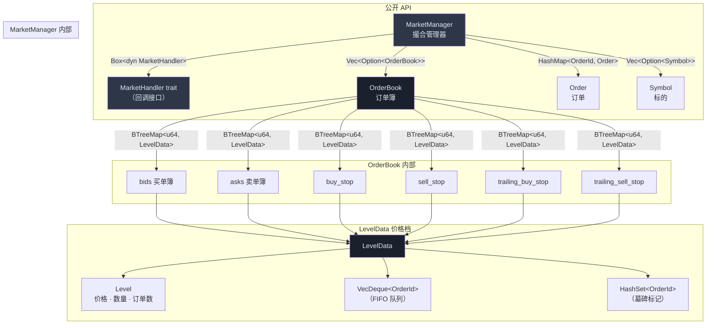
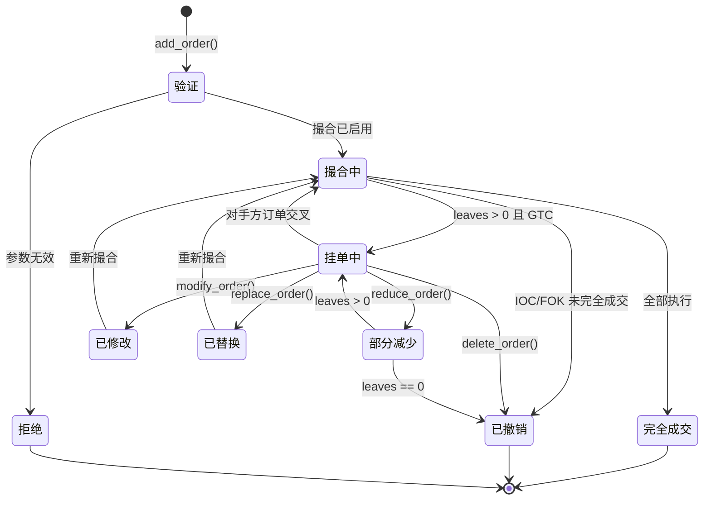
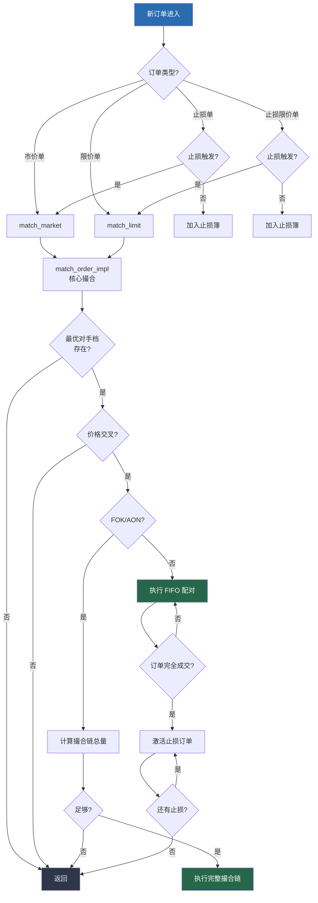
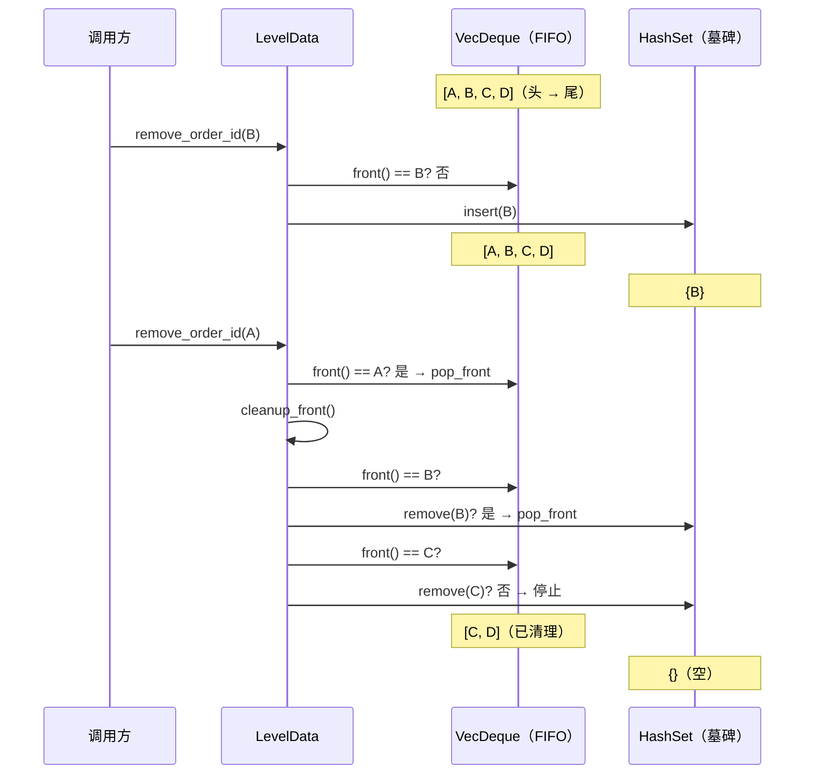

# cpptrader

[English](README.md) | 中文

高性能订单撮合引擎（Rust 实现）— [CppTrader](https://github.com/chronoxor/CppTrader) 的 Rust 移植版。

零运行时依赖（仅 `hashbrown`），`Copy` 优化的订单类型，基于 Tombstone 的 O(1) 订单队列。

## 系统架构



## 订单生命周期



## 撮合引擎流程



## 基于墓碑的订单队列

非队头订单的删除（撤单/减量）使用**惰性墓碑**模式，避免 O(n) 的 `VecDeque::retain`：



| 操作 | 时间复杂度 |
|---|---|
| 推入订单（挂单） | O(1) |
| 移除队头订单（撮合） | O(1) |
| 移除非队头订单（撤单） | O(1) 摊销 |
| 遍历有效订单 | O(n)，跳过墓碑 |
| 清理队头墓碑 | O(k)，k = 连续墓碑数 |

## 订单类型

| 类型 | 有效期 | 行为 |
|---|---|---|
| **市价单 (Market)** | IOC/FOK | 以最优价立即成交，未成交部分撤销 |
| **限价单 (Limit)** | GTC/IOC/FOK/AON | 未完全成交时挂入订单簿（GTC） |
| **止损单 (Stop)** | GTC/IOC/FOK | 市场价触及止损价后触发 → 转为市价单 |
| **止损限价单 (StopLimit)** | GTC/IOC/FOK/AON | 触发后 → 转为指定价格的限价单 |
| **追踪止损 (TrailingStop)** | GTC/IOC/FOK | 止损价随市场变动（绝对值或百分比距离） |
| **追踪止损限价 (TrailingStopLimit)** | GTC/IOC/FOK/AON | 追踪止损 + 触发后转限价 |

### 有效期 (Time-in-Force)

| TIF | 含义 |
|---|---|
| **GTC** | 撤单前有效 (Good-Till-Cancelled) — 挂入订单簿 |
| **IOC** | 立即成交或撤销 (Immediate-Or-Cancel) — 成交可成交部分，撤销剩余 |
| **FOK** | 全部成交或全部撤销 (Fill-Or-Kill) — 要么全部成交，要么全部撤销 |
| **AON** | 全数成交 (All-Or-None) — 要么全部成交，要么挂入订单簿 |

### 冰山单 (Iceberg Order)

在限价单上设置 `max_visible_quantity < u64::MAX`。可见部分显示在订单簿中；隐藏部分仅在可见部分成交后才逐步显现。

### 飞行中缓解 (In-Flight Mitigation)

`mitigate_order(id, new_price, new_quantity)` 在考虑已成交量的基础上调整订单数量，防止订单竞争时的过度成交。

## 性能基准

运行基准测试：

```sh
cargo bench --bench matching
```

AMD EPYC 单核测试结果：

| 场景 | 耗时 | 吞吐量 |
|---|---|---|
| 限价挂单 × 100 | 12 µs | **830 万单/秒** |
| 限价挂单 × 1,000 | 73 µs | **1,370 万单/秒** |
| 限价挂单 × 10,000 | 620 µs | **1,610 万单/秒** |
| 市价扫单 1 档 × 1,000 | 48 µs | **2,080 万笔/秒** |
| 市价扫单 10 档 × 100 | 49 µs | **2,040 万笔/秒** |
| FOK 跨 10 档成功 | 47 µs | **2,130 万笔/秒** |
| FOK 扫描 10 档失败 | 2.7 µs | — |
| 减少 100 笔非队头订单 | 4.9 µs | **2,040 万次/秒** |
| 激活 1,000 笔止损单 | 79 µs | **1,270 万次/秒** |

## 使用方法

### 作为库依赖

在 `Cargo.toml` 中添加：

```toml
[dependencies]
cpptrader = { git = "https://github.com/GreyRaphael/cpptrader-rs" }
```

### 基础用法

```rust
use cpptrader::*;

fn main() {
    // 1. 创建撮合管理器（使用默认空回调）
    let mut mm = MarketManager::with_default_handler();

    // 2. 注册标的和订单簿
    let sym = Symbol::new(1, b"AAPL    ");
    mm.add_symbol(sym).unwrap();
    mm.add_order_book(&sym).unwrap();

    // 3. 添加挂单
    mm.add_order(Order::buy_limit(1, 1, 15000, 100, OrderTimeInForce::Gtc, u64::MAX)).unwrap();
    mm.add_order(Order::sell_limit(2, 1, 15100, 200, OrderTimeInForce::Gtc, u64::MAX)).unwrap();

    // 4. 启用自动撮合
    mm.enable_matching();

    // 5. 添加交叉订单 — 触发撮合
    mm.add_order(Order::buy_limit(3, 1, 15100, 50, OrderTimeInForce::Gtc, u64::MAX)).unwrap();

    // 6. 查询状态
    let ob = mm.get_order_book(1).unwrap();
    println!("最优买价: {:?}", ob.best_bid().map(|l| l.level.price));
    println!("最优卖价: {:?}", ob.best_ask().map(|l| l.level.price));
    println!("活跃订单数: {}", mm.order_count());
}
```

### 自定义事件回调

实现 `MarketHandler` trait 接收所有市场事件：

```rust
use cpptrader::*;

struct MyHandler {
    trade_count: usize,
}

impl MarketHandler for MyHandler {
    fn on_execute_order(&mut self, order: &Order, price: u64, quantity: u64) {
        self.trade_count += 1;
        println!("成交: 订单 {} 成交 {} @ {}", order.id, quantity, price);
    }

    fn on_add_order(&mut self, order: &Order) {
        println!("新订单: {}", order);
    }

    fn on_delete_order(&mut self, order: &Order) {
        println!("订单结束: {}", order);
    }

    // 其他回调使用默认空实现
}

fn main() {
    let handler = Box::new(MyHandler { trade_count: 0 });
    let mut mm = MarketManager::new(handler);
    // ... 正常使用
}
```

### 集成到交易策略

```rust
// 在你的交易引擎 crate 中：
use cpptrader::{MarketManager, MarketHandler, Order, OrderBook, Symbol, OrderTimeInForce};

struct StrategyHandler {
    // 你的策略状态
}

impl MarketHandler for StrategyHandler {
    fn on_execute_order(&mut self, order: &Order, price: u64, quantity: u64) {
        // 将成交通知传给策略引擎
    }

    fn on_update_order_book(&mut self, order_book: &OrderBook, top: bool) {
        if top {
            // 最优价格变化 — 触发策略逻辑
        }
    }
}

pub fn run_engine() {
    let mut mm = MarketManager::new(Box::new(StrategyHandler { /* ... */ }));

    // 接入市场数据
    let sym = Symbol::new(1, b"ES      ");
    mm.add_symbol(sym).unwrap();
    mm.add_order_book(&sym).unwrap();
    mm.enable_matching();

    // 处理来自 FIX/ITCH 等协议的订单
    // mm.add_order(incoming_order);
}
```

### 可用回调列表

| 回调方法 | 触发时机 |
|---|---|
| `on_add_symbol` | 标的注册 |
| `on_delete_symbol` | 标的删除 |
| `on_add_order_book` | 订单簿创建 |
| `on_update_order_book` | 订单簿最优价变化 |
| `on_delete_order_book` | 订单簿删除 |
| `on_add_level` | 新价格档创建 |
| `on_update_level` | 价格档数量变化 |
| `on_delete_level` | 价格档删除 |
| `on_add_order` | 订单进入系统 |
| `on_update_order` | 订单状态变更（部分成交、修改） |
| `on_delete_order` | 订单移除（完全成交、撤单） |
| `on_execute_order` | 成交事件（价格、数量） |

### 交互式命令行

```sh
cargo run --example matching_engine
```

```
CppTrader Matching Engine — 输入 `help` 查看用法，`quit` 退出

> add-symbol 1 AAPL
> add-book 1
> enable
> add 1 1 buy limit 15000 100
> add 2 1 sell limit 15100 200
> add 3 1 buy limit 15100 50
  [event] executed: order 2 @ 15100 qty=50
> book 1
> orders
> quit
```

## 项目结构

```
src/
├── lib.rs                      # Crate 根，类型重导出
└── matching/
    ├── mod.rs                  # 模块声明
    ├── types.rs                # OrderSide, OrderType, OrderTimeInForce, LevelType, UpdateType
    ├── error.rs                # ErrorCode, Result<T>
    ├── symbol.rs               # Symbol（id + 8 字节名称）
    ├── level.rs                # Level, LevelUpdate
    ├── order.rs                # Order 结构体、验证、工厂方法
    ├── order_book.rs           # OrderBook（BTreeMap 价格档 + 墓碑队列）
    ├── market_handler.rs       # MarketHandler trait（回调接口）
    └── market_manager.rs       # MarketManager — 核心撮合引擎
tests/
    └── matching_engine_tests.rs  # 40 个集成测试
benches/
    └── matching.rs             # Criterion 基准测试（5 组）
examples/
    ├── matching_engine.rs      # 交互式 CLI
    └── market_manager.rs       # 回调演示
```

## 测试

```sh
# 运行全部测试
cargo test

# Clippy 静态检查
cargo clippy --all-targets

# 运行性能基准
cargo bench --bench matching
```

## 设计决策

| 决策 | 原因 |
|---|---|
| `BTreeMap<u64, LevelData>` 作为价格档 | O(log n) 插入，`next_back()`/`next()` O(1) 取最优价，原生 range 查询 |
| `VecDeque<OrderId>` + 墓碑 `HashSet` 实现 FIFO | 队头撮合 O(1)，撤单摊销 O(1)，无侵入式链表开销 |
| `Order` 派生 `Copy` | 112 字节，纯整数字段 — 消除热路径堆分配 |
| `Box<dyn MarketHandler>` 回调 | 动态分发保持灵活性；调用点 `#[inline]` 包装 |
| `HashMap<OrderId, Order>` 存储订单 | O(1) 按 ID 查找，无内存池复杂度 |
| `symbol_id` 用 `u32` 索引 `Vec` | O(1) 标的/订单簿查找，对应 ITCH 协议 `StockLocate` |

## 致谢

- 原始 C++ 实现：[CppTrader](https://github.com/chronoxor/CppTrader) by Ivan Shynkarenka
- Rust 移植与优化：[GreyRaphael](https://github.com/GreyRaphael)

## 许可证

MIT
