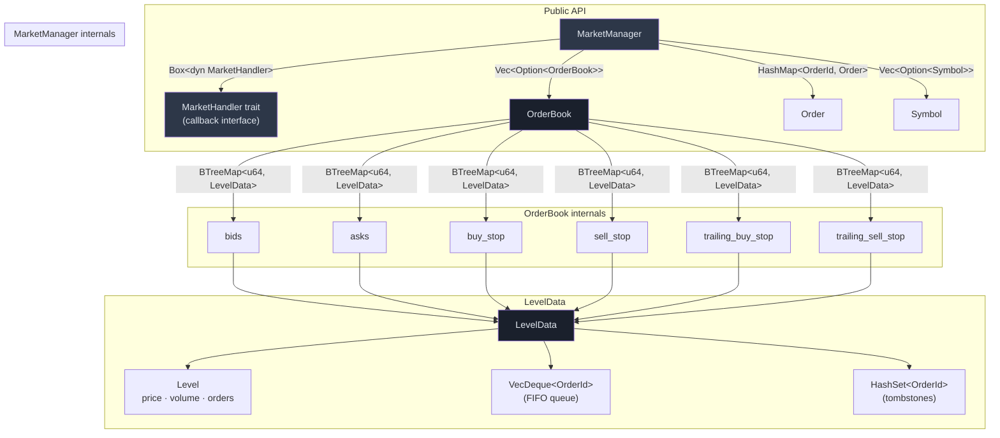
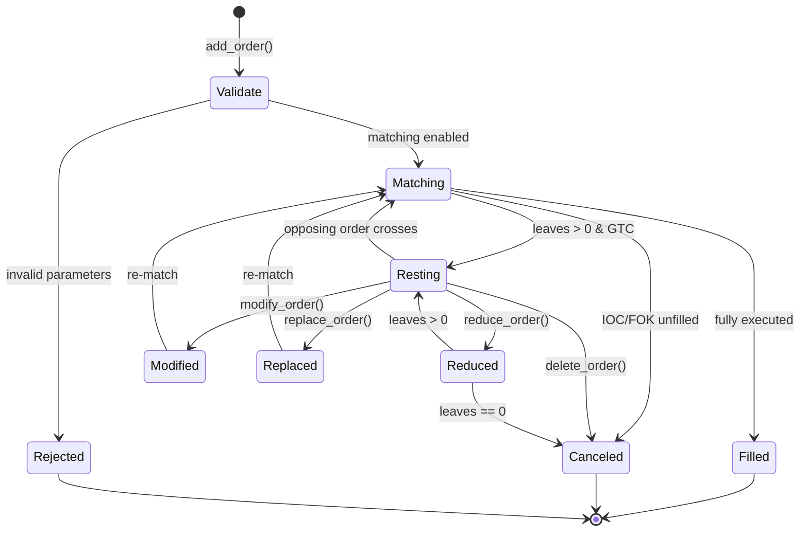
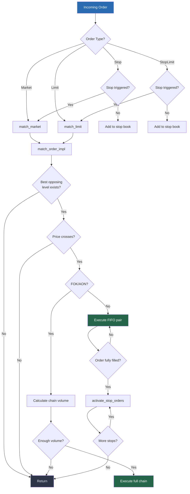
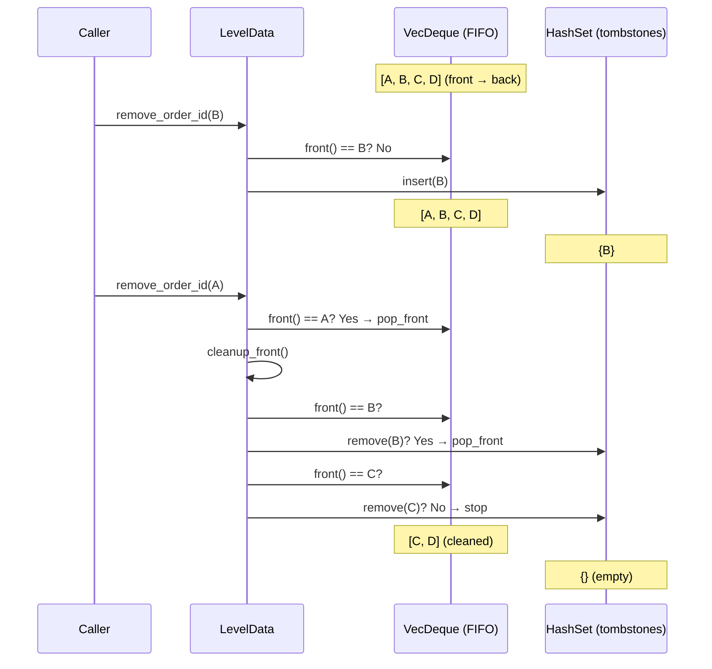

# cpptrader

English | [中文](README-CN.md)

High-performance order matching engine in Rust — a port of [CppTrader](https://github.com/chronoxor/CppTrader).

Zero runtime dependencies (except `hashbrown`), `Copy`-optimized order types, and a tombstone-based O(1) order queue.

## Architecture



## Order Lifecycle



## Matching Engine Flow



## Tombstone-Based Order Queue

Non-front order removal (cancel/reduce) uses a **lazy tombstone** pattern instead of O(n) `VecDeque::retain`:



| Operation | Time Complexity |
|---|---|
| Push order (add) | O(1) |
| Remove front order (match) | O(1) |
| Remove non-front order (cancel) | O(1) amortized |
| Iterate valid orders | O(n), skips tombstones |
| Cleanup tombstones at front | O(k) where k = consecutive tombstones |

## Order Types

| Type | TIF | Behavior |
|---|---|---|
| **Market** | IOC/FOK | Execute immediately at best price, cancel remainder |
| **Limit** | GTC/IOC/FOK/AON | Rest in book if not fully filled (GTC) |
| **Stop** | GTC/IOC/FOK | Triggered when market price crosses stop price → becomes Market |
| **StopLimit** | GTC/IOC/FOK/AON | Triggered → becomes Limit at specified price |
| **TrailingStop** | GTC/IOC/FOK | Stop price adjusts with market (absolute or percentage distance) |
| **TrailingStopLimit** | GTC/IOC/FOK/AON | Trailing + Limit conversion on trigger |

### Time-in-Force

| TIF | Meaning |
|---|---|
| **GTC** | Good-Till-Cancelled — rests in book |
| **IOC** | Immediate-Or-Cancel — fill what's available, cancel the rest |
| **FOK** | Fill-Or-Kill — fill entirely or cancel entirely |
| **AON** | All-Or-None — fill entire quantity or rest in book |

### Iceberg Orders

Set `max_visible_quantity < u64::MAX` on a Limit order. The visible portion is shown in the order book; the hidden portion is only revealed as the visible part fills.

### In-Flight Mitigation (IFM)

`mitigate_order(id, new_price, new_quantity)` adjusts an order's quantity accounting for already-executed fills, preventing over-execution when orders race.

## Benchmarks

Run with:

```sh
cargo bench --bench matching
```

Results on AMD EPYC (single-core, Linux):

| Scenario | Time | Throughput |
|---|---|---|
| Batch limit add (100 orders, no match) | 12 µs | **8.3M orders/sec** |
| Batch limit add (1,000 orders, no match) | 73 µs | **13.7M orders/sec** |
| Batch limit add (10,000 orders, no match) | 620 µs | **16.1M orders/sec** |
| Market sweep (1 level, 1,000 resting orders) | 48 µs | **20.8M trades/sec** |
| Market sweep (10 levels, 100 orders each) | 49 µs | **20.4M trades/sec** |
| FOK success across 10 price levels | 47 µs | **21.3M trades/sec** |
| FOK fail — scan 10 levels, insufficient volume | 2.7 µs | — |
| Batch reduce non-front orders (100, same level) | 4.9 µs | **20.4M ops/sec** |
| Batch activate stop orders (1,000) | 79 µs | **12.7M ops/sec** |

## Usage

### As a Library

Add to your `Cargo.toml`:

```toml
[dependencies]
cpptrader = { git = "https://github.com/GreyRaphael/cpptrader-rs" }
```

### Basic Example

```rust
use cpptrader::*;

fn main() {
    // 1. Create manager with a handler
    let mut mm = MarketManager::with_default_handler();

    // 2. Register symbol and order book
    let sym = Symbol::new(1, b"AAPL    ");
    mm.add_symbol(sym).unwrap();
    mm.add_order_book(&sym).unwrap();

    // 3. Add resting orders
    mm.add_order(Order::buy_limit(1, 1, 15000, 100, OrderTimeInForce::Gtc, u64::MAX)).unwrap();
    mm.add_order(Order::sell_limit(2, 1, 15100, 200, OrderTimeInForce::Gtc, u64::MAX)).unwrap();

    // 4. Enable automatic matching
    mm.enable_matching();

    // 5. Add a crossing order — triggers matching
    mm.add_order(Order::buy_limit(3, 1, 15100, 50, OrderTimeInForce::Gtc, u64::MAX)).unwrap();

    // 6. Query state
    let ob = mm.get_order_book(1).unwrap();
    println!("Best bid: {:?}", ob.best_bid().map(|l| l.level.price));
    println!("Best ask: {:?}", ob.best_ask().map(|l| l.level.price));
    println!("Active orders: {}", mm.order_count());
}
```

### Custom Event Handler

Implement `MarketHandler` to receive all market events:

```rust
use cpptrader::*;

struct MyHandler {
    trade_count: usize,
}

impl MarketHandler for MyHandler {
    fn on_execute_order(&mut self, order: &Order, price: u64, quantity: u64) {
        self.trade_count += 1;
        println!("TRADE: order {} filled {} @ {}", order.id, quantity, price);
    }

    fn on_add_order(&mut self, order: &Order) {
        println!("NEW: {}", order);
    }

    fn on_delete_order(&mut self, order: &Order) {
        println!("DONE: {}", order);
    }

    // Other callbacks use default no-op implementations
}

fn main() {
    let handler = Box::new(MyHandler { trade_count: 0 });
    let mut mm = MarketManager::new(handler);
    // ... use mm as usual
}
```

### Using as a Dependency with Custom Strategy

```rust
// In your trading engine crate:
use cpptrader::{MarketManager, MarketHandler, Order, OrderBook, Symbol, OrderTimeInForce};

struct StrategyHandler {
    // Your strategy state
}

impl MarketHandler for StrategyHandler {
    fn on_execute_order(&mut self, order: &Order, price: u64, quantity: u64) {
        // Feed fills to your strategy
    }

    fn on_update_order_book(&mut self, order_book: &OrderBook, top: bool) {
        if top {
            // Best price changed — trigger strategy logic
        }
    }
}

pub fn run_engine() {
    let mut mm = MarketManager::new(Box::new(StrategyHandler { /* ... */ }));

    // Feed market data
    let sym = Symbol::new(1, b"ES      ");
    mm.add_symbol(sym).unwrap();
    mm.add_order_book(&sym).unwrap();
    mm.enable_matching();

    // Process incoming orders from FIX/ITCH/etc.
    // mm.add_order(incoming_order);
}
```

### Available Callbacks

| Callback | When |
|---|---|
| `on_add_symbol` | Symbol registered |
| `on_delete_symbol` | Symbol removed |
| `on_add_order_book` | Order book created |
| `on_update_order_book` | Book top-of-book changed |
| `on_delete_order_book` | Order book removed |
| `on_add_level` | New price level created |
| `on_update_level` | Level volume changed |
| `on_delete_level` | Price level removed |
| `on_add_order` | Order enters the system |
| `on_update_order` | Order state changed (partial fill, modify) |
| `on_delete_order` | Order removed (full fill, cancel) |
| `on_execute_order` | Trade executed (price, quantity) |

### Interactive CLI

```sh
cargo run --example matching_engine
```

```
CppTrader Matching Engine — type `help` for usage, `quit` to exit

> add-symbol 1 AAPL
> add-book 1
> enable
> add 1 1 buy limit 15000 100
> add 2 1 sell limit 15100 200
> add 3 1 buy limit 15100 50
  [event] executed: order 2 @ 15100 qty=50
> book 1
> orders
> quit
```

## Project Structure

```
src/
├── lib.rs                      # Crate root, re-exports
└── matching/
    ├── mod.rs                  # Module declarations
    ├── types.rs                # OrderSide, OrderType, OrderTimeInForce, LevelType, UpdateType
    ├── error.rs                # ErrorCode, Result<T>
    ├── symbol.rs               # Symbol (id + 8-byte name)
    ├── level.rs                # Level, LevelUpdate
    ├── order.rs                # Order struct, validation, factory methods
    ├── order_book.rs           # OrderBook with BTreeMap levels + tombstone queue
    ├── market_handler.rs       # MarketHandler trait (callback interface)
    └── market_manager.rs       # MarketManager — central matching engine
tests/
    └── matching_engine_tests.rs  # 40 integration tests
benches/
    └── matching.rs             # Criterion benchmarks (5 groups)
examples/
    ├── matching_engine.rs      # Interactive CLI
    └── market_manager.rs       # Handler callback demo
```

## Testing

```sh
# Run all tests
cargo test

# Run with clippy
cargo clippy --all-targets

# Run benchmarks
cargo bench --bench matching
```

## Design Decisions

| Decision | Rationale |
|---|---|
| `BTreeMap<u64, LevelData>` for price levels | O(log n) insert, O(1) best bid/ask via `next_back()`/`next()`, native range queries |
| `VecDeque<OrderId>` + tombstone `HashSet` for FIFO | O(1) front match, O(1) amortized cancel, no per-order linked list overhead |
| `Order` derives `Copy` | 112 bytes, all integer fields — eliminates heap allocation on hot path |
| `Box<dyn MarketHandler>` for callbacks | Dynamic dispatch for flexibility; `#[inline]` wrappers at call sites |
| `HashMap<OrderId, Order>` for order storage | O(1) lookup by ID, no pool allocator complexity |
| `symbol_id` as `u32` index into `Vec` | O(1) symbol/orderbook lookup, mirrors ITCH `StockLocate` |

## Credits

- Original C++ implementation: [CppTrader](https://github.com/chronoxor/CppTrader) by Ivan Shynkarenka
- Rust port and optimization: [GreyRaphael](https://github.com/GreyRaphael)

## License

MIT
